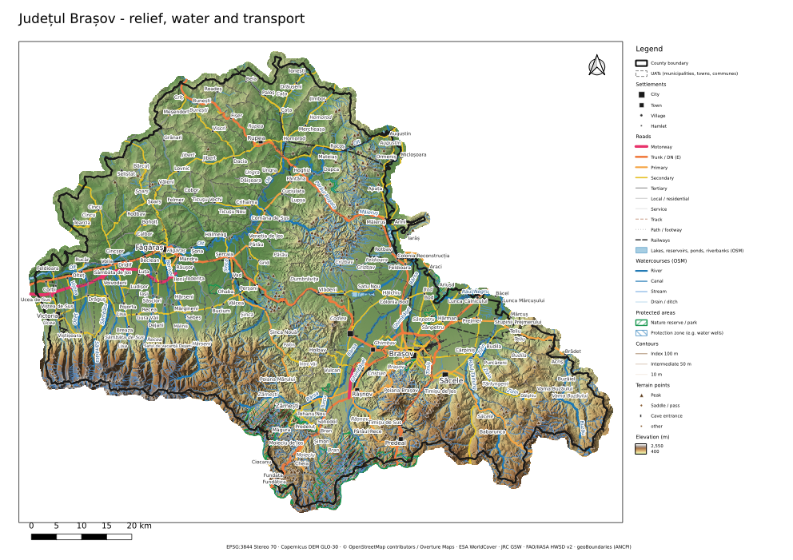
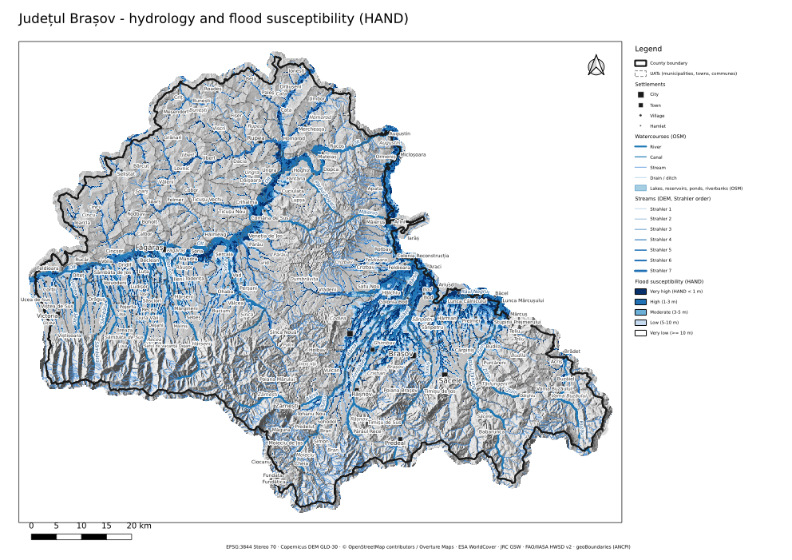
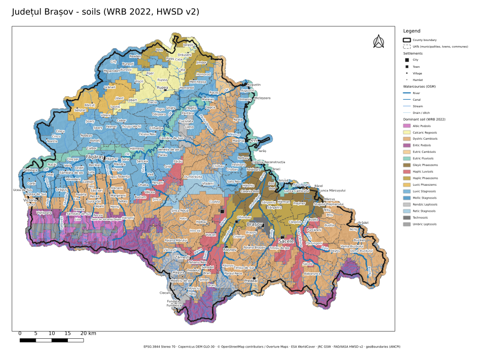
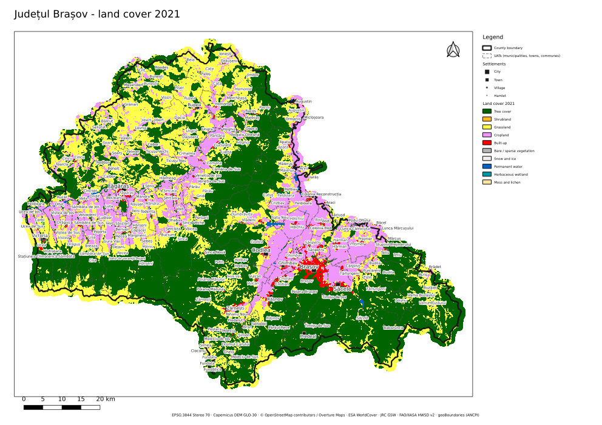
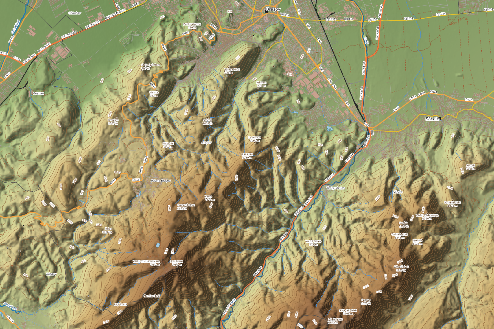

# Județul Brașov — geospatial base dataset (topography, soil, water)

A complete, GIS-ready base for planning work in **Brașov County, Romania**:
terrain, hydrology, soils, surface water, land cover, transport, buildings and administrative
units, all in the national projection **EPSG:3844 (Stereo 70)**, plus a styled QGIS project
with print layouts. Every layer is rebuilt from open data by the scripts in `scripts/`.

| | |
|---|---|
| Area | 5,361 km² (county) + 1 km context ring |
| Administrative units | 58 UATs: 4 municipii, 6 orașe, 48 comune |
| Elevation range | 401 m (Olt valley at Ucea) to 2,502 m (Bucegi massif, Bran UAT) on the 25 m DEM |
| CRS | EPSG:3844 Pulkovo 1942(58) / Stereo70, metres |
| Terrain grid | 25 m (land cover and imagery 10 m), all rasters cell-aligned |
| Size | about 320 MB; largest single file 75 MB (buildings) |



## Open it

### Option 1: one file, `brasov_county_qgis.gpkg` (375 MB)

Everything in a single GeoPackage: all 26 vector layers and tables, all 18 rasters, the styles
and the complete QGIS project with its four A3 layouts. It is too large for GitHub (100 MB per
file limit), so it is not in this repository. Get it from the chat, or rebuild it with
`python scripts/11_single_gpkg.py` (about 2 minutes once `data/` exists).

1. Save the file **without renaming it**. The embedded project finds its layers by this file
   name, so `brasov_county_qgis (1).gpkg` breaks the links. If that happens, rename it back,
   or use *Auto-Find* in QGIS's "Handle Unavailable Layers" dialog.
2. In QGIS (3.34 LTR or newer), open the **Browser** panel, navigate to the file, expand it,
   and double-click **Brasov County** (the project, listed under the GeoPackage).
   Or: *Project → Open From → GeoPackage*, pick the file, choose *Brasov County*.
3. To use single layers in your own project instead, drag the `.gpkg` onto the map. Vector
   layers come in with their styles (stored in the file); rasters arrive unstyled.

In this file the float rasters (DEM, slope, ruggedness, HAND, wetness) are stored as 16-bit
tiles at a fixed precision (DEM ±5 cm, slope ±0.025°, TWI ±0.005), far below the source
accuracy. Upstream area and all categorical layers are lossless.

### Option 2: this folder, `brasov_county.qgz` + `data/`

* **QGIS:** open `brasov_county.qgz`. Layers are grouped (Administrative, Transport &
  infrastructure, Buildings, Water & hydrology, Topography, Soil, Land use & land cover,
  Imagery, Online basemaps). Four ready-made **A3 layouts** are under *Project → Layouts*:
  overview, water and flood susceptibility, soils, land cover. Styles are also stored *inside*
  each GeoPackage and as `.qml` files next to each raster, so layers keep their symbology when
  you drag them into another project. Keep `data/` next to the `.qgz`.
* **ArcGIS Pro, Global Mapper, FME, AutoCAD Map 3D, etc.:** add the `.gpkg` and `.tif` files
  directly. They are standard OGC GeoPackages and Cloud Optimized GeoTIFFs. Styles are QGIS-only.

### Either way

* **Soil styles:** the soil layer has a second saved style. In *Layer Properties → Style →
  Load Style → From database*, pick "hydrologic soil group" to switch to the A-D runoff view.
* **3D view:** in QGIS use *View → 3D Map View*, then *Terrain → DEM (raster layer)* with
  `Elevation (DEM) 25 m`, and drape the Sentinel-2 imagery or any thematic layer.
* **Spreadsheet:** `data/uat_planning_statistics.csv` has one row per UAT.

## What's inside

Full catalogue with feature counts, sources and licences: **[data/LAYERS.md](data/LAYERS.md)**.

| Theme | Layers |
|---|---|
| **Topography** | DEM 25 m · multidirectional hillshade · slope (°) · **planning slope classes** (<2, 2-5, 5-10, 10-15, 15-25, 25-35, 35-50, ≥50 %) · aspect · terrain ruggedness · **landforms** (geomorphons: ridge, valley, footslope, …) · **contours every 10 m** (50 m / 100 m index) · named peaks, saddles, caves, cliffs |
| **Water & hydrology** | **DEM-derived stream network** (Strahler & Shreve order, upstream area, gradient) · **sub-catchments** (≥10 km²) · major drainage basins · flow direction · upstream area · **HAND** (height above nearest drainage) · **flood susceptibility classes** · **topographic wetness index** · mapped rivers, streams, canals, ditches, lakes, reservoirs, springs (OSM) · **JRC surface-water history 1984-2021** (occurrence, recurrence, seasonality, change) |
| **Soil** | HWSD v2 soil mapping units: dominant WRB 2022 soil and all components, drainage, rootable depth, AWC, **topsoil (0-20 cm) and subsoil (20-100 cm)** sand/silt/clay, texture, organic carbon, pH, CEC, base saturation, bulk density, CaCO₃, coarse fragments · derived **hydrologic soil group A-D** · full horizon table D1-D7 (0-200 cm) |
| **Land cover / use** | ESA WorldCover 2021 (10 m) · OSM land use · natural areas · **protected areas** (Bucegi Natural Park, Piatra Craiului, Tâmpa, Dumbrava Vadului, …) and drinking-water well protection zones |
| **Infrastructure** | Roads with class and DN/DJ/E route numbers · railways · power lines, towers, substations · bridges, dams, pipelines, ski lifts · 11k points of interest · **233,147 building footprints** |
| **Administrative** | County outline · 58 UAT polygons with a **planning statistics block** · neighbouring counties · settlements |
| **Imagery** | Sentinel-2 true colour 10 m, single cloud-free pass (26 July 2025), offline |

### UAT planning statistics

Every UAT polygon (and the CSV) carries: elevation min/mean/max; mean slope; % of area with
slope <5, 5-15, 15-25 and >25 %; % of area with very high or high flood susceptibility; % forest,
grassland, cropland, built-up and water; dominant soil and % hydrologic soil group D; number of
buildings and their footprint; road length (excluding paths and tracks); stream density.

## Method notes

* **One grid for everything.** The Copernicus GLO-30 DEM is resampled once (bilinear) to a 25 m
  Stereo 70 grid, and every terrain and hydrology raster is cut from that grid, so cells overlay
  exactly. Outputs are masked to the county plus 1 km.
* **Hydrology covers the whole upstream Olt.** Flow routing runs on a larger window
  (24.45-26.65 °E, 45.25-46.98 °N) that contains the upper Olt and Râul Negru catchments in
  Harghita and Covasna, so upstream areas are complete: the Olt drains about 10,000 km² where
  it leaves the county. Conditioning is least-cost depression breaching, then filling
  (WhiteboxTools). Channels start at 1 km² upstream area. Check: 87 % of the length of
  OpenStreetMap-mapped rivers lies within 150 m of a DEM-derived channel draining ≥10 km².
* **Flood susceptibility = HAND classes** (<1, 1-3, 3-5, 5-10, ≥10 m above the nearest
  drainage). It is a terrain screening layer: it ignores levees, flow volumes and return periods.
* **Hydrologic soil group** comes from topsoil USDA texture (A: sands and sandy loams;
  B: loams and silt loams; C: sandy clay loam; D: clayey soils). Poorly drained soils and soils
  shallower than 50 cm become D (NRCS NEH 630 ch. 7 convention).
* **Contours** come from the 25 m DEM after light Gaussian smoothing (σ = 1 cell), simplified
  to 2 m tolerance.

## Limitations — read before using for statutory plans

* **The DEM is a surface model (DSM).** Copernicus GLO-30 includes forest canopy and buildings,
  so in forests contours and elevations can sit 10-30 m above the ground. Heights refer to the
  EGM2008 geoid, not the Romanian Black Sea 1975 datum. The two can differ by up to about a
  metre. For engineering or PUZ-level work use ANCPI's LiDAR terrain model and survey data.
* **Soil is mapped at ~1 km.** HWSD v2 in Romania is generalised from the European Soil
  Database. It is fine for county-scale planning but not for individual parcels; use
  OSPA/ICPA soil studies there. The ready-made `05b_soilgrids_optional.py` adds ISRIC
  SoilGrids 250 m rasters, but it could not run in the build environment (host blocked) and
  has not been tested.
* **Flood susceptibility is not the official flood hazard map.** Statutory plans must use the
  ANAR flood hazard and risk maps (PMRI).
* **Protected areas are incomplete.** Only what OpenStreetMap maps is included. Natura 2000
  sites (SCI/SPA) and the official boundaries from ANANP or the Ministry of Environment are
  missing and should be added.
* **Buildings** mix OSM footprints (about 137k) and Microsoft ML-detected footprints (about
  97k), which are good for density analysis but are not cadastral.
* **Boundaries** are the ANCPI UAT polygons as published by geoBoundaries (2023). They are not a
  cadastral or legal delimitation.

## Data not included (not openly available or not reachable here)

| Need | Where to get it |
|---|---|
| Natura 2000 and national protected areas | ANANP / Ministry of Environment, EEA Natura 2000 database |
| Official flood hazard and risk maps | ANAR (Planurile de Management al Riscului la Inundații) |
| LiDAR DTM, high-resolution orthophotos, cadastral parcels | ANCPI (geoportal, eTerra) |
| Detailed soil studies | OSPA Brașov, ICPA |
| Geology and hydrogeology | Institutul Geologic al României (IGR) |
| Groundwater bodies, water management | ANAR / ABA Olt |
| Climate normals (precipitation, temperature) | ANM; or WorldClim / CHELSA (global) |

## Rebuild or extend

```bash
mamba env create -f environment.yml && conda activate brasov-geo
export PYTHONPATH=$CONDA_PREFIX/share/qgis/python   # for 10_qgis_project.py
bash scripts/run_all.sh                              # about 15 min on 4 cores
```

Downloads are cached in `_raw/` and intermediates in `_work/` (both git-ignored). Region and
parameters live in `scripts/common.py`: buffer, grid size, hydrology window. Stream and
sub-catchment thresholds are in `scripts/04_hydrology.py`. To build the same package for
another county, change the ISO code in `01_boundaries.py` and the bounding boxes in `common.py`.

## Sources and attribution

Use this attribution line on maps:

> Copernicus DEM GLO-30 © DLR e.V. / Airbus, provided under COPERNICUS by the EU and ESA ·
> © OpenStreetMap contributors, Overture Maps Foundation (ODbL) · ESA WorldCover 2021 (CC BY 4.0)
> · EC JRC Global Surface Water (Pekel et al. 2016) · FAO & IIASA HWSD v2.0 · geoBoundaries /
> ANCPI (CC BY 4.0) · contains modified Copernicus Sentinel-2 data 2025

* **ODbL (OSM/Overture layers):** if you publish a modified database built from these layers,
  it must be shared under ODbL. Maps and printed plans only need the attribution.
* **HWSD v2** is published by FAO and IIASA. FAO material is usually CC BY-NC-SA 3.0 IGO
  (non-commercial), so check the terms before commercial use.
* Everything else is open with attribution (CC BY 4.0 or the Copernicus licence).

| Preview | |
|---|---|
|  |  |
|  |  |
